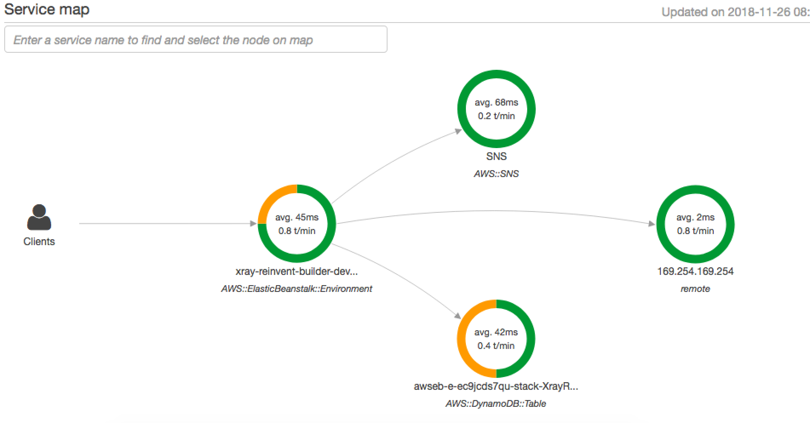
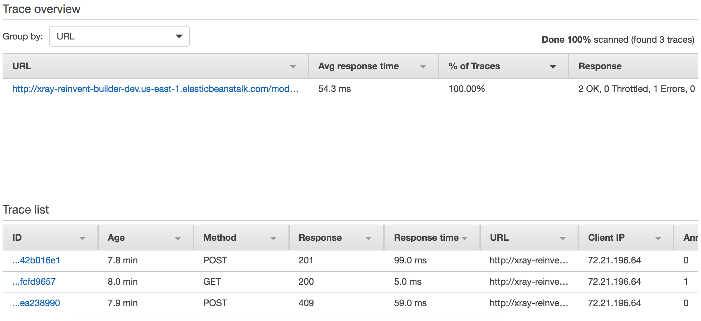
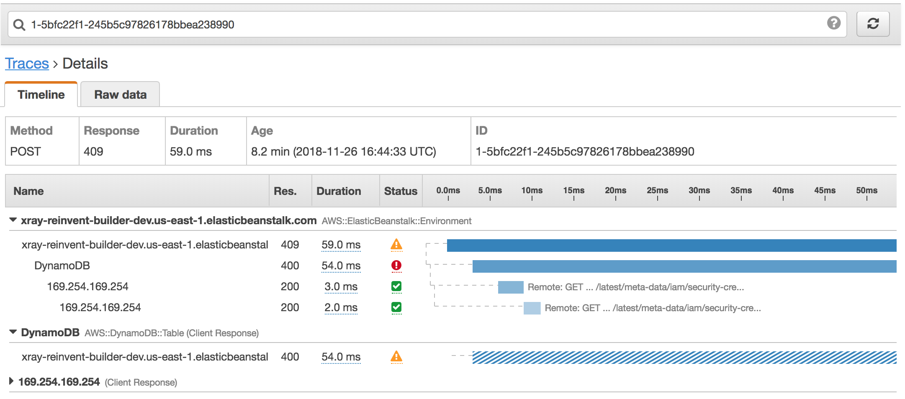
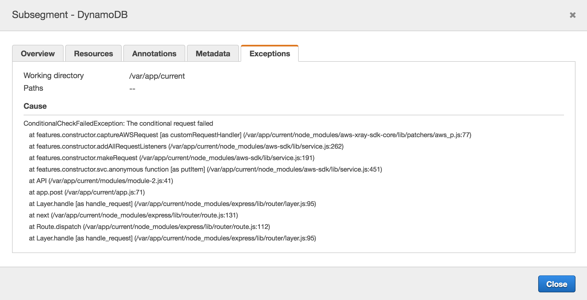

# Module 2 - Errors

Now that we've integrated AWS X-Ray into our codebase we want to start capturing more granular information.

Currently, duplicate email submissions are rejected due to the DynamoDB primary key uniqueness but we're not gracefully returning an error back to the client.

Once you're ready, head into the `modules/module-2.js` file and follow the instructions. 

In this module, we want to capture the `ConditionalCheckFailedException` returned by DynamoDB and return the proper status code back to the client.

After the missing code has been implemented, you can deploy the application to start capturing `Module 2` tracing information.

## Deploy app
From the `app` folder run

>eb deploy

Once its finished, open the application by running

>eb open

Sign up a few users, try to sign up with the same user more than once as well to get some errors back.

## Review traces

### Service Map
After playing with the application, head into the AWS X-Ray [console](https://console.aws.amazon.com/xray) and select `Service map`. You should now see an average of all your requests.

### Traces
You can also select a particular trace from the `Traces` view.

If we select a particular trace, we can choose one that has failed (you can determine that by the status code), information about the particular error would've been populated without needing to add any extra code into our application.

## Wrap up
Now you know that AWS X-Ray will capture errors and exceptions your application might throw, as well as reviewing them in the console.