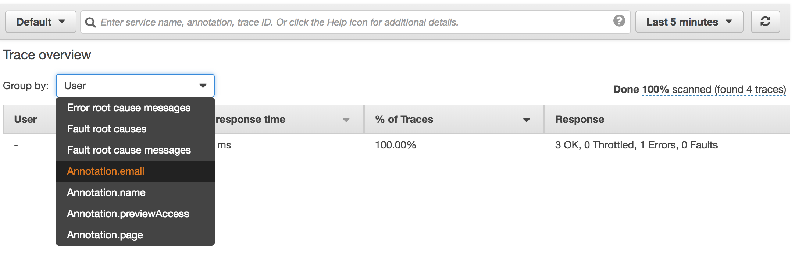
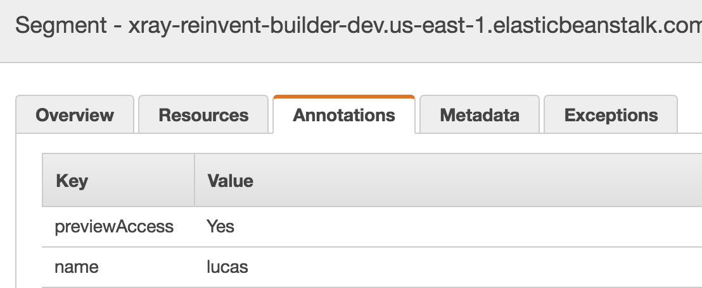

# Module 3 - Annotations

At this stage, we've working with the information that AWS X-Ray captures out of the box.

In this module you'll learn about `Annotations`, a way to add your own data into the traces that will not only allow you to enrich them but also it will provide you with the ability to group them based on the keys that you have created.

Once you're ready, head into the `modules/module-3.js` file and follow the instructions. 

After the missing code has been implemented, you can deploy the application to start capturing `Module 3` tracing information.

## Deploy app
From the `app` folder run

>eb deploy

Once its finished, open the application by running

>eb open

Sign up a few users, try to sign up with the same user more than once as well to get some errors back.

## Review traces

### Service Map
After playing with the application, head into the AWS X-Ray [console](https://console.aws.amazon.com/xray) and select `Service map`. You should now see an average of all your requests.

### Traces
You can also select a particular trace from the `Traces` view.

We can also group traces based on the keys that you have provided as annotations.

If we select a particular trace, we can choose one that has failed (you can determine that by the status code), information about the particular error would've been populated without needing to add any extra code into our application.

## Extra information
Not covered in this module, is also the concept of `Metadata`. `Metadata` behaves very similarly to `Annotations` with the exception that the former cannot be used for grouping traces purposes.

## Wrap up
Now you know how to feed your own data to enrich traces.