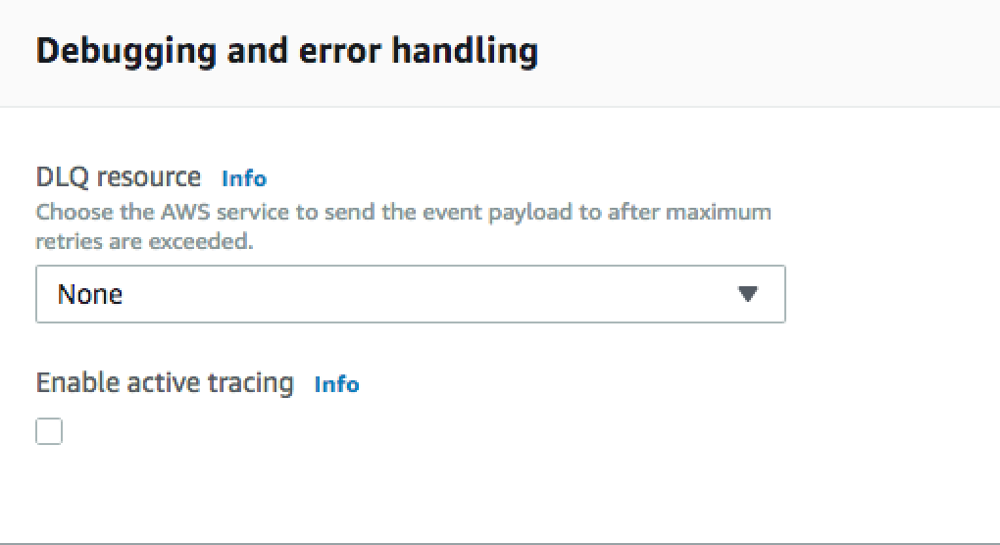

# Module 4 - Third Party

So far, all of our traces are coming from within our application.

In this module you'll learn how to continue capturing tracing information even when the requests follows a remote call.

After the lambda function has been deployed you can start capturing `Module 4` tracing information.

## Setup
The function that will be using for this module will perform the same backend logic as our app did. As a reminded, it will add a new entry into our DynamoDB table (if the key is unique) and trigger a SNS notification back to us.

Navigate to the `lambda` folder and deploy the already provided artifact.

>aws lambda update-function-code --function-name XrayReinventBuilderLambda --zip-file fileb://lambda.zip

AWS Lambda also has AWS X-Ray support without the need of installing the daemon. For lambda to start capturing information, just enable `active tracing` from the `Debugging and error handling` section.

## Deploy app
From the `app` folder run

>eb deploy

Once its finished, open the application by running

>eb open

Sign up a few users, try to sign up with the same user more than once as well to get some errors back.

## Review traces

### Service Map
After playing with the application, head into the AWS X-Ray [console](https://console.aws.amazon.com/xray) and select `Service map`. You should now see an average of all your requests.

[Service Map Image]

### Traces
You can also select a particular trace from the `Traces` view.

[Traces Image]

In this view we can see how AWS X-Ray follows the trace to whichever service it goes as long as information about it keeps getting sent into the daemon.

## Extra information
Not covered in this module but if you wanted to trace a request to a service hosted on `EC2` or even on-premises, you just need to capture the trace id from the request headers.

In environments in which the AWS X-Ray daemon is not installed by default, you can install it and send traces information to it.

## Wrap up
Now you know how to trace requests that might leave the context of your application into different microservices.